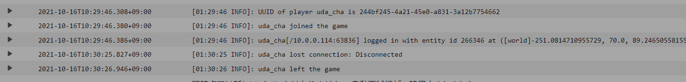
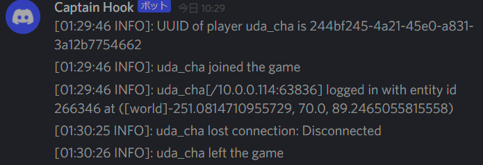

# cloudwatch_logs_to_discord

`CloudWatch Log`のLambdaサブスクリプションフィルターから受け取ったログをWebhookでDiscordのチャンネルに送るlambda関数



↓



## How to use

### Create Discord webhook

[https://support.discord.com/hc/ja/articles/228383668-タイトル-Webhooksへの序章](https://support.discord.com/hc/ja/articles/228383668-%E3%82%BF%E3%82%A4%E3%83%88%E3%83%AB-Webhooks%E3%81%B8%E3%81%AE%E5%BA%8F%E7%AB%A0)

を参考に、DiscordのWebhookを作成します。以下の形式のURLが与えられます。

```
https://discord.com/api/webhooks/{webhook.id}/{webhook.token}
```

`{webhook.id}`、および `{webhook.token}`を控えておきます。


### Build and packaging

```sh
GOOS=linux go build cloudwatch_logs_to_discord.go
zip cloudwatch_logs_to_discord.zip cloudwatch_logs_to_discord
```

### Deploy to AWS Lambda

`Services` => `Lambda` -> `Create a Lambda Function`

* Runtime: `Go 1.x`
* handler: `cloudwatch_logs_to_discord`
* Environment variables:
    * `WEBHOOK_ID` = `{webhook.id}`
    * `WEBHOOK_TOKEN` = `{webhook.token}`

作成後、先ほど作成したzipファイルをアップロード

### Create CloudWatch Log Subscription Filter

`CloudWatch` => `Log groups`

通知したいロググループを選択して、
`アクション` => `サブスクリプションフィルター` => `Lambda サブスクリプションフィルターを作成`

* 送信先: 先ほど作成したLambda関数
* ログ形式とフィルターを設定: Discordに送りたいログをここでフィルタ(何も設定しなければすべてのログが対象)
